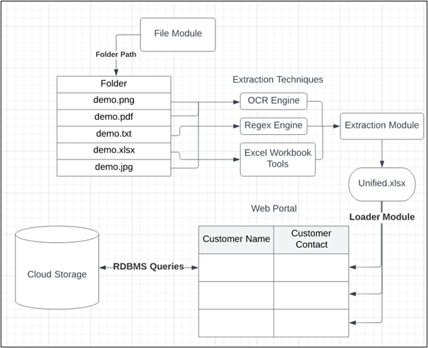

## Customer-Relation-Management-Portal Automation using RPA Solutions (UIPATH)
CRM Portal which is a clone of the Google Contact app in the form of a Web App using React JS FrontEnd Framework with TailWind CSS Framework and Mobx JS library.

## What is UIPATH?
A platform that provides RPA Solutions to automate menial tasks like browsing the net or online shopping. It is an AI-powered Platform that combines leading robotic process automation (RPA) with a full suite of capabilities to understand, automate, and operate end-to-end processes, offering unprecedented time to value. 

More Info on UIPATH: [Link](https://www.uipath.com/company/about-us)

## Project's Components
- [Website deployment for storing customer's data on cloud/database](#website-deployment)
- [RPA component for automation](#rpa-solution)
- [Project's Workflow](#projects-workflow)
- [Live Demonstration](#live-demonstration)

## Website Deployment
###  Customer Data

A Google Contact Webapp clone 

Getting Started 

First, clone this repository or download the zip on your local computer and extract it. 
Download 'Yarn' on your computer as that is the package manager used in the project: 
- Yarn Installation through npm (if you already have npm package manager installed)

      npm install --global yarn
  
More info on yarn installation: [Link](https://classic.yarnpkg.com/lang/en/docs/install/#windows-stable)

Move to the [Website Folder](./Website). Open Powershell/Command Prompt in this directory and type:

    yarn

This will load all the website-related files 
Deploy the website locally on port 3000: 

      yarn dev

#### Tools Used
React - JavaScript library for building user interfaces. 
TailwindCSS - CSS framework. 
MobX - Javascript state management library. 

#### Live Website Deployment: https://playful-customer-data.netlify.app/

## RPA Solution

- The RPA workflow is present in the [RPA Folder](./RPA) location.
- The folder contains a subfolder [data](./RPA/data), including customer data in different file formats.
- The [Main.xaml](./RPA/Main.xaml) is the RPA workflow file which can only be viewed and updated using UIPath software/platform.
- The Project.json file is just the name and versions of packages used in the RPA workflow which generated by UIPath.
- The [Unified.xlsx](./Unified.xlsx) is the file where customer data from all file formats present in the data folder is aggregated.
 (It is generated by the RPA workflow on running)

## Project's Workflow

  

Steps involved:
- Initially, we take the file path where all the customer data in different file formats is stored as input.
- Extracting the list of files present in that directory and building a datatable to store all the customer data present in different file formats.
- Loop through all the files present in the directory and extract their file extension to identify the file formats.
- if: current file type is in PDF format
  - Extract the text present in the pdf and apply regex modules to extract customer names, email, and phone numbers.
- else if: file is of type Text (.txt)
  - Then we extract the data in text format and then apply the regex module followed by the Data row append module (UIPath feature) to add it to the common datatable
- else if: file is a docx type file.
  - Then we extract the text using the word activities (present in UIPath) and later we apply the regex module to extract the customer data followed by the data row append module to add the data to the common datatable.
- else if: file is an image file
  - Then we apply OCR activities to extract the data from the image file and later apply regex module and data row append module for further data processing.
- else if: file is in Excel format
  - Then we read the data using read range activity (present in UIPath) and later we simply merge the data table produced by read range to the parent data table where we are storing the unified customer data from all file formats.
- else if: file of CSV/Excel format
  - Then we extract the data into a datatable using read CSV/Excel activities and merge this extracted data table to the parent unified datatable.
- After data is extracted from all the files present in the path provided, the datatable holding all the customer information is converted to an Excel file.
- 
We open a browser and append the data present in the unified Excel file to the CRM Portal. Initially, customer data is extracted row-wise and before appending the activities checks whether the customer is already registered on the website by searching in the name in the website search bar and identifying if it has found any match using Find Element activity (UIPath feature), if not found then it creates a new customer contact.
Hence, this is how the process of CRM Portal is automated using RPA Solution.

## Live Demonstration
Youtube: 

